12306订票助手是绿色软件，无需安装。下载安装包([下载地址](http://www.fishlee.net/soft/12306/))之后，解压即可使用。

源程序目录，双击[12306订票助手.exe]启动程序

登录12306网站
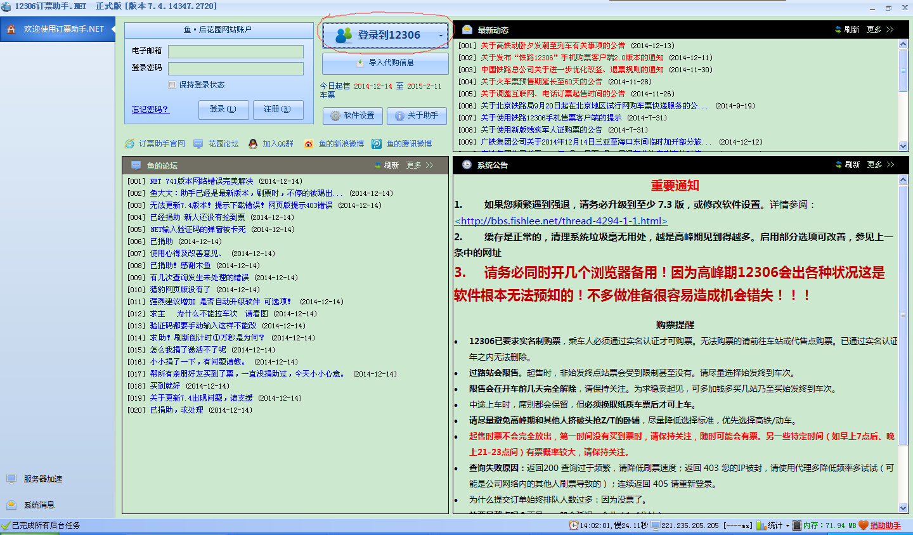

输入12306账号、密码登录
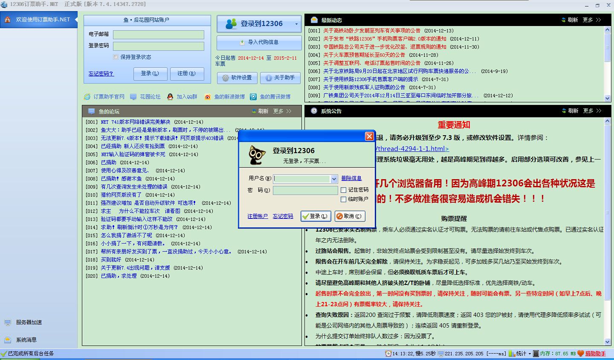

输入验证码
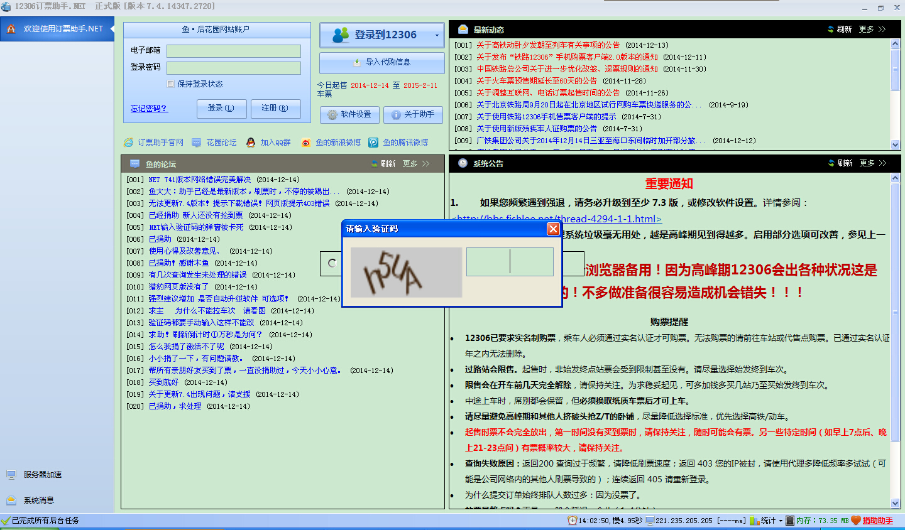

登录成功后的欢迎页面
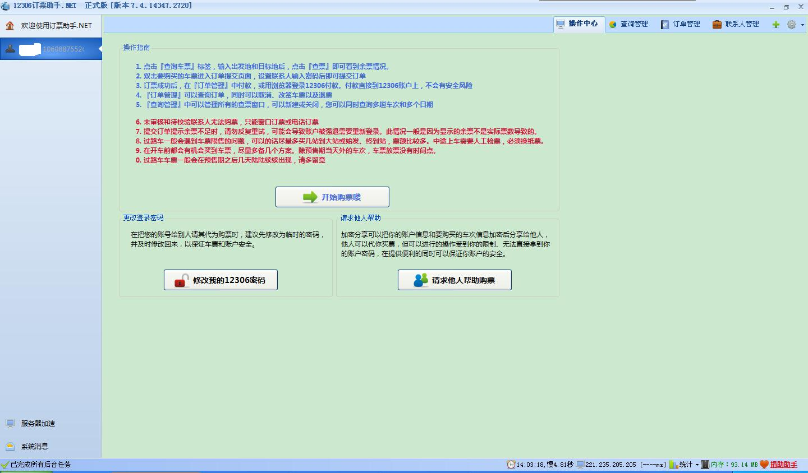

打开刷票购票页面
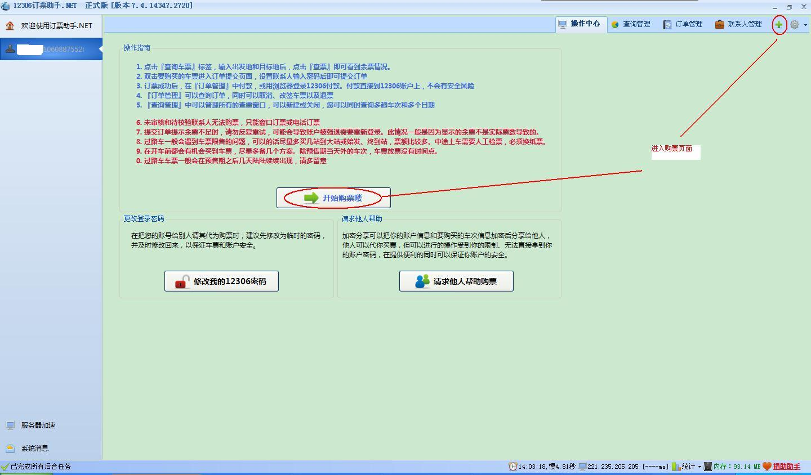

刷票购票页面
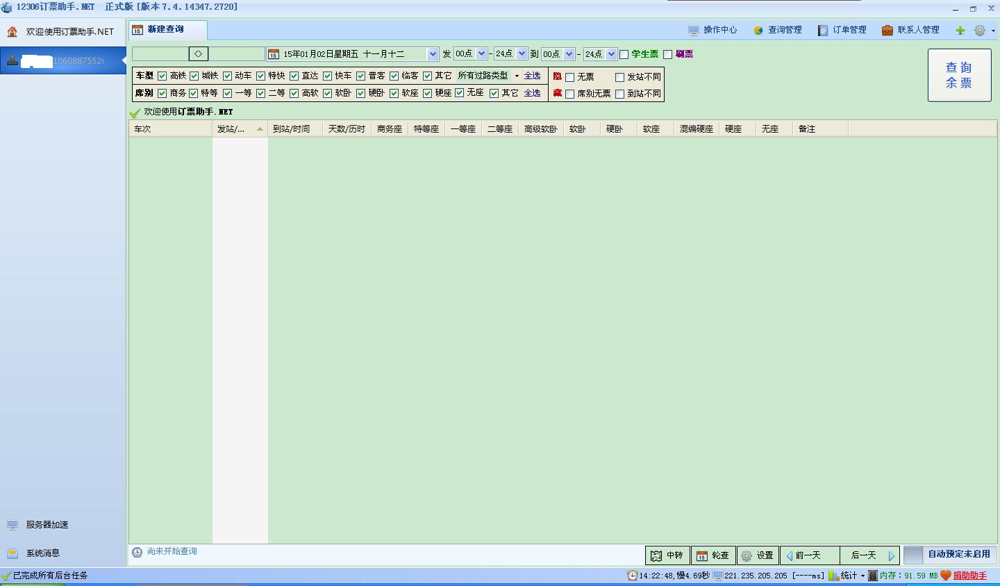

基本设置
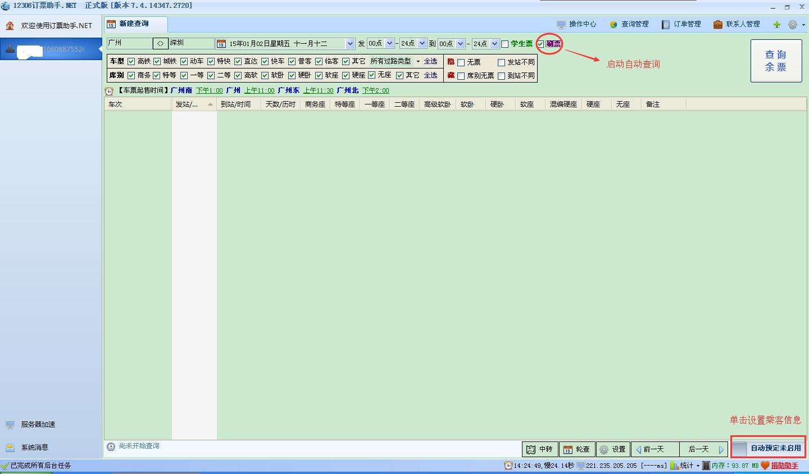

启用自动预定
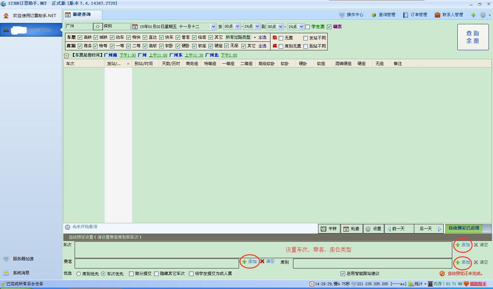

启用刷票
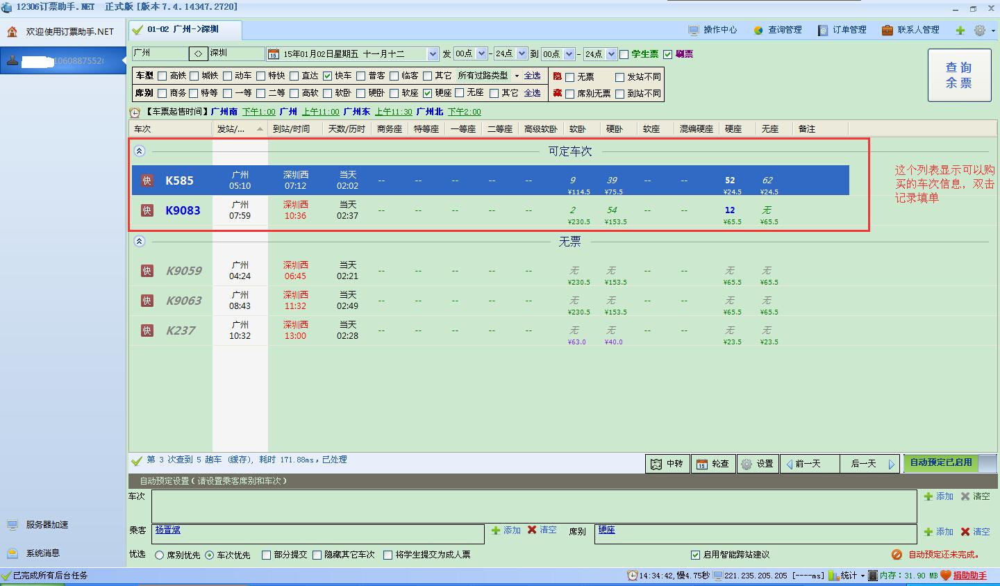

填入验证码下单
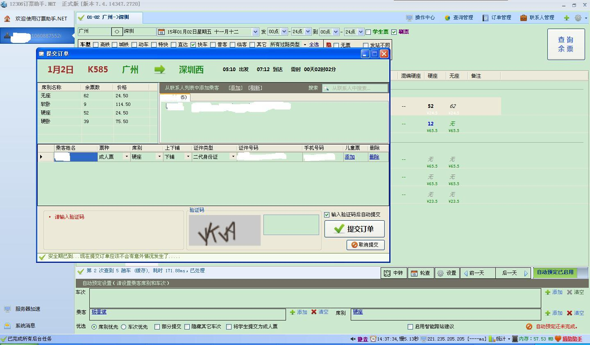

下单成功
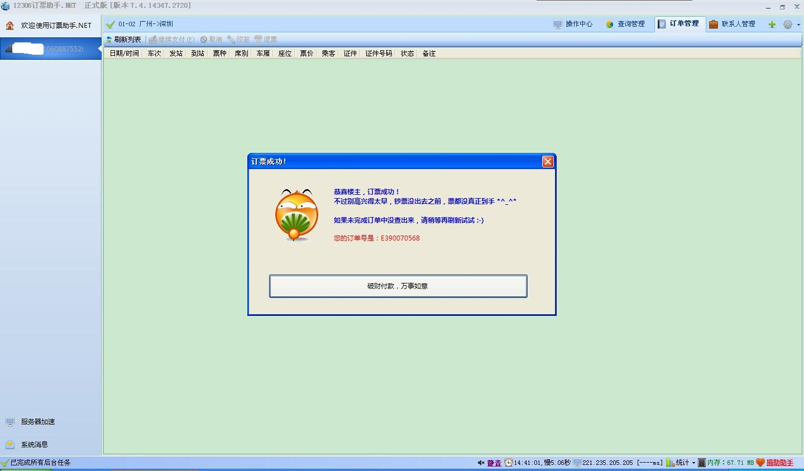

查询订单结果
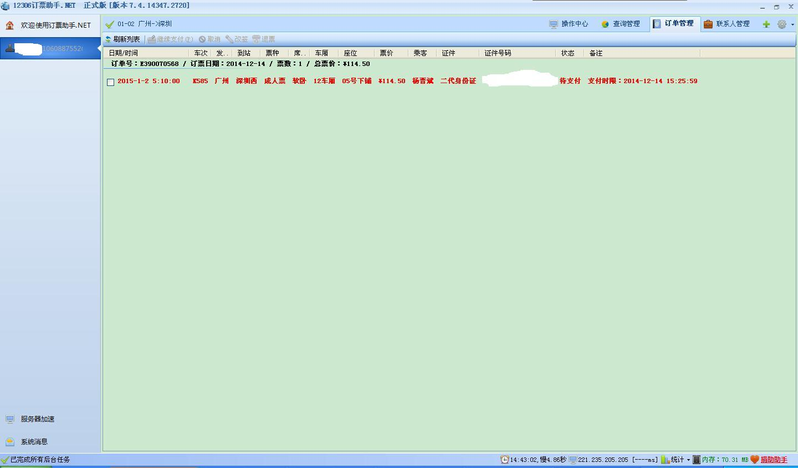

多页刷票，每个页面独立
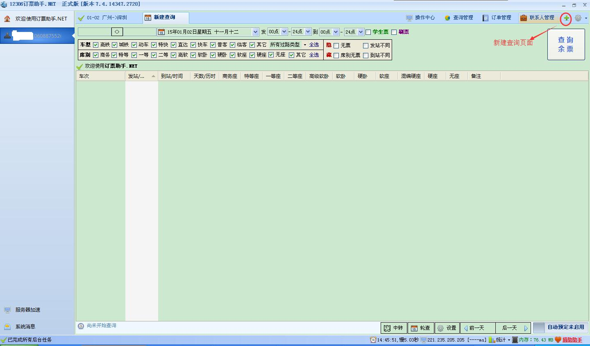

