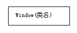
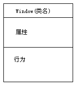

Title: UML学习笔记
Date: 2015-1-7 
Category: websites 
Tags: UML
Slug: UML
Author: tianruoxuanhe
Summary:

###1 UML类图中的关联、聚合和组合

###2 UML类图中的类

####2.1 类：是对具有相同属性、行为的实例的类型抽象。

在类图中的表示，类名、属性、行为

简化的类图：

细化的类图

####2.2 抽象类与具体类

抽象类：不能实例化，在类图中类名是斜体字，abstract属性真

具体类：可以实例化，在类图中类名是整体字

####2.3 主动类和非主动类

主动类：能主动发起行为的类

非主动类：不能主动发起行为的类，被动触发行为

####2.4 特征、属性、特性

特征：一个特征定义了分类器实例的一个行为特点或者一个结构特点。

属性：分类器结构相关的特征
属性 等同与 特性

行为：分类器行为相关的特征

####2.5 类的属性

静态属性和非静态属性

c++中等价于静态成员变量和非静态成员变量

静态属性带有下划线

描述相关：可见性，多重性

####2.6 类的行为

静态行为和非静态行为

c++中等价于静态成员函数和非静态员函数

同样静态行为带有下划线

描述相关：参数，约束，返回类型，可见性，多重性

